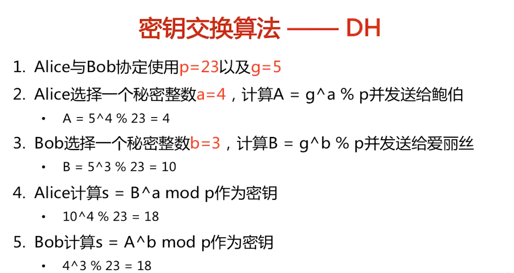
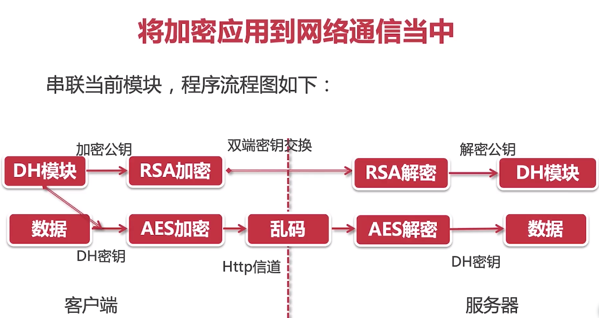

= 服务端平台搭建

== http 协议结构

* 请求行 - Method Request-URI HTTP Version

* 请求头 - K,V

* 空行 - /r/n

* 消息主体 - body

== http 服务器搭建

* 启动 socket 服务器

* 等待连接

* 传输数据包

== 开放加密库 - OpenSSL

== rsa 非对称加密

=== 生成RSA 私钥

----
openssl genrsa -out rsa_private.pem 2048

----

=== 转换成 pk8

----
openssl pkcs8 -topk8 -inform PEM -in rsa_private.pem -outform pem -nocrypt -out rsa_private_key.pem

----

=== 生成 rsa 公钥

----
openssl rsa -in rsa_private_key.pem -pubout -out rsa_public_key.pem

----

=== 使用方法

* 通过 KeyFactory 获取 rsa 算法实例

* 生成 rsa 公钥对象

* 获取 rsa Cipher

* 执行加密

=== 可能会出现 IOException : algid parse error, not a sequence

说明对齐方式不对

== AES 对称加密

=== 使用方法

* 根据 AES 密钥创建 Secret 密钥向量

* 生成初始化参数向量

* 获取 AES Cipher

* 执行加密，然后 Base64 编码

== DH 密钥交换

=== DH 密钥交换主要是两个公式编写

* 公钥计算公式

----
A = g exp a % p
B = g exp b % p

----

* 密钥计算公式

----
s = B|A exp (a|b) % p
----

* 生成随机数作为私钥

* 预置质数原根对

=== DH 密钥交换算法事例

=== 将加密应用到网络中

